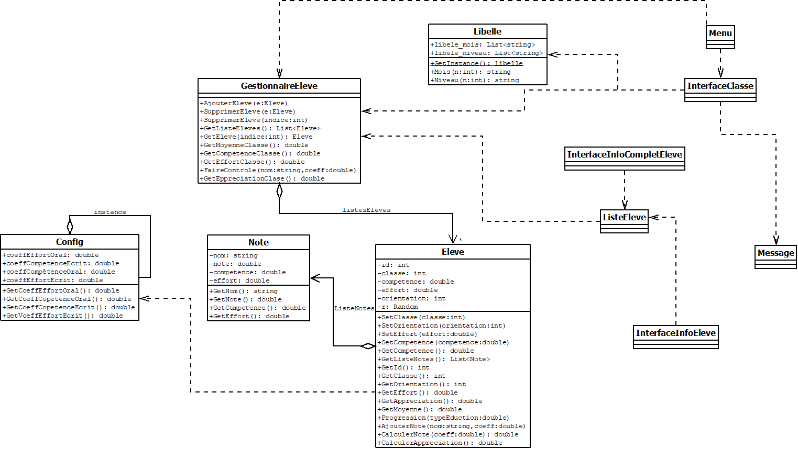

# Cahier Des Charges [CDC]

## Description des objectifs pédagogiques du jeu
### Objectif pédagogique général
La réussite des élèves dépend des méthodes d’enseignements du professeur, s’il privilégie plus les efforts ou plus les compétences, et aura un impact sur l’orientation futur des élèves.
### Description des objectifs pédagogiques

Les objectifs pour le joueur sont de prendre conscience de l’impact des décisions d’un enseignant sur le rapport à l’effort des élèves, d’agir de sorte à accompagner au mieux les élèves et de proposer un contenu adaptés aux profils de ceux-ci.

NOTION IMPORTANTE : effort et compétence

__Élèves d’une classe de lycée__
- Une classe de lycée à généralement entre 28 et 32 élèves.
- Ces élèves ont souvent des compétences différentes et ne fournissent pas forcément tous les mêmes efforts, ils n’ont pas le même profil.
- Une classe peut avoir des élèves avec des spécialités ou matières différentes.
- Ces élèves ont des choix d’orientations différents.  

__Professeurs principale d’une classe de lycée__
- Le professeur ne peut pas forcément faire réussir tous les élèves de sa classe, certaines méthodes d’enseignements sont positifs sur certains profils d’élèves et négatifs sur d’autres.
- Le professeur décide quel élève va dans quel spécialité, les places sont limité, il ne peut donc pas forcément mettre tous les élèves dans la spécialité de leur choix, il doit savoir si un élève peut réussir dans spécialité ou non.

## Décisions prises

- - [x] Public cible : Enseignants en formation.
- - [x] Le joueur incarne un enseignant qui a à sa charge une unique classe évoluant avec lui de la seconde à la terminale.
- - [x] Prototype :

    - - [x] 2D.
    - - [x] Vue du dessus de la classe (coupée).
    - - [x] Langage choisi : C#
    - - [x] Framework choisi : .NET
    - - [x] Mise en commun via Git.
    - - [x] Fin du jeu sur l’orientation des élèves.
    - - [x] Points de score attribués selon l’homogénéité de l’orientation des élèves. (correspondant aux proportions “réelles”)
    - - [x] Pas d’aléatoire au départ, sauf pour les valeurs initiales (on peut les mettre une fois le prototype stable).
    - - [ ] Types de choix :

        - - [x] Méthodes de notation. (+ Note de vie scolaire / participation au choix)
        - - [x] Vitesse d’enseignement.
        - - [ ] Choix de l’orientation en fin de classe de seconde. (Places limitées par filière)
        - - [ ] Cours supplémentaires personnalisés. 
        - - [ ] Charge de travail en dehors des cours.

## MCD

## Question

*Est-ce que vous avez des questions sur le déroulement de la partie que nous venons de vous montrer ?* 
J’ai trouvé votre jeu intéressant avec la possibilité de laisser le choix de noter plus l’effort ou la compétence.

### Description des fonctionnalités 
__Entrée__
##### Gestion des tours

- _Valider_ : Valide les choix du tour et passer au tour suivant

##### Gestion des choix

- _Notation effort_ : coefficient que prend les efforts dans la notation
- _Notation compétence_ : coefficient que prend les compétences dans la notation
- _Niveau des cours_ : le niveau de compétence requis pour le cours

__Sorties__

__Gestion des tours__
- _moisActuel_ : le mois actuel du tour
- _anneeActuelle_ : la classe actuelle du tour

__Gestion de la classe__
- _MoyenneClasse_ : la moyenne générale de la classe
- _CompetenceClasse_ : la moyenne des compétences actuelles de la classe
- _EffortClasse_ : la moyenne des efforts actuels de la classe

__Gestion des élèves__

- _idEleve_ : le numéro de l’élève
- _EffortEleve_ : l’effort actuel de l’élève
- _CompetenceEleve_ : la compétence actuel de l’élève
- _DerniereNoteEleve_ : la dernière note reçu par l’élève
- _ClasseEleve_ : la classe actuelle de l’élève
- _MoyenneEleve_ : la moyenne générale actuelle de l’élève
- _listeNotesEleve_ : toutes les notes de l’élèves avec ces compétence et effort au moment de la note

### Moteur interne

##### Gestion des tours
- ***Valider :***
    - moisActuel++ 
    - Si le mois est Mai et non terminal : anneeActuelle++
##### Gestion des choix

- ***Notations effort et compétence :***
    - Le calcul de la note est le suivant :
    effort * coefficientEffort + competence * coefficientCompetence
    - Pour tous les élèves : un choix de forte notation sur l’effort donnera de bonne note à ce qui font beaucoup d’effort et a contrario tiendra moins compte des compétence. 
- ***Niveau des cours :*** 
    - Pour tous les élèves : Un cours d’un niveau trop bas par rapport au niveau d’un élève fera baisser ses efforts. A contrario un trop haut niveau  fera abandonner l’élève.

## Scénarios
### Scénario tutoriel

Partie scénarisée avec trois élèves, avec des attributs prédéfinis (pour simuler au mieux une classe hétérogène), pour comprendre les différentes conséquences des choix pris par le joueur. Avec un résultat gagnant ou perdant.

- 3 élèves : [ <Élève 1, effort 9.22, compétence 1, dernière note 10 >, <Élève 2, effort 4.5 , compétence 5, dernière note 10 >, <Élève 3, effort 0.75 , compétence 9, dernière note 10 >]
- nombre de tours : 28

__Déroulement gagnant :__ 

1)  Le joueur assigne le coefficient de notation d'effort à 1.5 et de compétence à 0.5, et comme type de cours 3. 
2)  Le joueur assigne le coefficient de notation d'effort à 1.5 et de compétence à 0.5, et comme type de cours 3. 
3)  Le joueur assigne le coefficient de notation d'effort à 1.5 et de compétence à 0.5, et comme type de cours 4. 
4)  Le joueur assigne le coefficient de notation d'effort à 2 et de compétence à 0, et comme type de cours 3. 
5)  Le joueur assigne le coefficient de notation d'effort à 2 et de compétence à 0, et comme type de cours 3. 
6)  Le joueur assigne le coefficient de notation d'effort à 2 et de compétence à 0, et comme type de cours 3. 
7)  Le joueur assigne le coefficient de notation d'effort à 1 et de compétence à 1, et comme type de cours 3. 
8)  Le joueur assigne le coefficient de notation d'effort à 1 et de compétence à 1, et comme type de cours 3. 
9)  Le joueur assigne le coefficient de notation d'effort à 1 et de compétence à 1, et comme type de cours 4. 
10) Le joueur assigne le coefficient de notation d'effort à 1 et de compétence à 1, et comme type de cours 4. 
11) Le joueur assigne le coefficient de notation d'effort à 1 et de compétence à 1, et comme type de cours 4. 
12) Le joueur assigne le coefficient de notation d'effort à 1 et de compétence à 1, et comme type de cours 4. 
13) Le joueur assigne le coefficient de notation d'effort à 1.5 et de compétence à 0.5, et comme type de cours 4. 
14) Le joueur assigne le coefficient de notation d'effort à 1.5 et de compétence à 0.5, et comme type de cours 4. 
15) Le joueur assigne le coefficient de notation d'effort à 1.5 et de compétence à 0.5, et comme type de cours 5. 
16) Le joueur assigne le coefficient de notation d'effort à 2 et de compétence à 0, et comme type de cours 4. 
17) Le joueur assigne le coefficient de notation d'effort à 2 et de compétence à 0, et comme type de cours 4. 
18) Le joueur assigne le coefficient de notation d'effort à 2 et de compétence à 0, et comme type de cours 5. 
19) Le joueur assigne le coefficient de notation d'effort à 2 et de compétence à 0, et comme type de cours 5. 
20) Le joueur assigne le coefficient de notation d'effort à 2 et de compétence à 0, et comme type de cours 5. 
21) Le joueur assigne le coefficient de notation d'effort à 1 et de compétence à 1, et comme type de cours 7. 
22) Le joueur assigne le coefficient de notation d'effort à 1 et de compétence à 1, et comme type de cours 7. 
23) Le joueur assigne le coefficient de notation d'effort à 1.6 et de compétence à 0.4, et comme type de cours 7. 
24) Le joueur assigne le coefficient de notation d'effort à 1.4 et de compétence à 0.6, et comme type de cours 5. 
25) Le joueur assigne le coefficient de notation d'effort à 1.4 et de compétence à 0.6, et comme type de cours 5. 
26) Le joueur assigne le coefficient de notation d'effort à 0.5 et de compétence à 1.5, et comme type de cours 6. 
27) Le joueur assigne le coefficient de notation d'effort à 0.5 et de compétence à 1.5, et comme type de cours 6. 
28) Le joueur assigne le coefficient de notation d'effort à 1 et de compétence à 1, et comme type de cours 5. 

__Vous avez gagné :__

- :white_check_mark: ***Effort moyen : 7.34***
- :white_check_mark: ***Compétence moyenne : 6.295***
- :white_check_mark: ***Notes moyennes : 12.33***
- :white_check_mark: ***L’effort a augmenté de : 46.8% / 33.3%***
- :white_check_mark: ***Les compétences ont augmentés de : 25.9% / 25%***
- :white_check_mark: ***La moyenne a augmenté de : 23.3% / 0% (Au moins autant de moyenne)***

__Déroulement perdant :__

1)  Le joueur assigne le coefficient de notation d'effort à 0.2 et de compétence à 1.8, et comme type de cours 8. 
2)  Le joueur assigne le coefficient de notation d'effort à 0.2 et de compétence à 1.8, et comme type de cours 8. 
3)  Le joueur assigne le coefficient de notation d'effort à 1.2 et de compétence à 0.8, et comme type de cours 2. 
4)  Le joueur assigne le coefficient de notation d'effort à 1.2 et de compétence à 0.8, et comme type de cours 2. 
5)  Le joueur assigne le coefficient de notation d'effort à 1.2 et de compétence à 0.8, et comme type de cours 5. 
6)  Le joueur assigne le coefficient de notation d'effort à 1 et de compétence à 1, et comme type de cours 7. 
7)  Le joueur assigne le coefficient de notation d'effort à 1 et de compétence à 1, et comme type de cours 7. 
8)  Le joueur assigne le coefficient de notation d'effort à 0.5 et de compétence à 1.5, et comme type de cours 7. 
9)  Le joueur assigne le coefficient de notation d'effort à 0.5 et de compétence à 1.5, et comme type de cours 7. 
10) Le joueur assigne le coefficient de notation d'effort à 1 et de compétence à 1, et comme type de cours 4. 
11) Le joueur assigne le coefficient de notation d'effort à 1 et de compétence à 1, et comme type de cours 4. 
12) Le joueur assigne le coefficient de notation d'effort à 1.5 et de compétence à 0.5, et comme type de cours 7. 
13) Le joueur assigne le coefficient de notation d'effort à 1.5 et de compétence à 0.5, et comme type de cours 7. 
14) Le joueur assigne le coefficient de notation d'effort à 1.5 et de compétence à 0.5, et comme type de cours 8. 
15) Le joueur assigne le coefficient de notation d'effort à 1.5 et de compétence à 0.5, et comme type de cours 8. 
16) Le joueur assigne le coefficient de notation d'effort à 1 et de compétence à 1, et comme type de cours 3. 
17) Le joueur assigne le coefficient de notation d'effort à 1.3 et de compétence à 0.7, et comme type de cours 7. 
18) Le joueur assigne le coefficient de notation d'effort à 1.3 et de compétence à 0.7, et comme type de cours 7. 
19) Le joueur assigne le coefficient de notation d'effort à 1.3 et de compétence à 0.7, et comme type de cours 4. 
20) Le joueur assigne le coefficient de notation d'effort à 1.3 et de compétence à 0.7, et comme type de cours 4. 
21) Le joueur assigne le coefficient de notation d'effort à 1 et de compétence à 1, et comme type de cours 8. 
22) Le joueur assigne le coefficient de notation d'effort à 1 et de compétence à 1, et comme type de cours 8. 
23) Le joueur assigne le coefficient de notation d'effort à 1 et de compétence à 1, et comme type de cours 8. 
24) Le joueur assigne le coefficient de notation d'effort à 1 et de compétence à 1, et comme type de cours 5. 
25) Le joueur assigne le coefficient de notation d'effort à 1 et de compétence à 1, et comme type de cours 5. 
26) Le joueur assigne le coefficient de notation d'effort à 1.5 et de compétence à 0.5, et comme type de cours 6. 
27) Le joueur assigne le coefficient de notation d'effort à 1.5 et de compétence à 0.5, et comme type de cours 6. 
28) Le joueur assigne le coefficient de notation d'effort à 1 et de compétence à 1, et comme type de cours 5. 

__Vous avez perdu car les compétences de la classe ne sont pas suffisantes :__

- :white_check_mark: ***Effort moyen : 7.49***
- :x: ***Compétence moyenne : 6.24***
- :white_check_mark: ***Notes moyennes : 11.85***
- :white_check_mark: ***L’effort a augmenté de : 56% / 33.3%***
- :x: ***Les compétences ont augmentés de : 24.8% / 25%***
- :white_check_mark: ***La moyenne a augmenté de : 18.5% / 0% (Au moins autant de moyenne)***

Il est nécessaire de se trouver dans des intervalles valides à la fin de la partie sur ces trois seuils simultanément afin de gagner celle-ci. 
Dans le cas présent, un de ces trois intervalles n’est pas validé, ce qui cause l’échec du joueur.

### Scénarios complémentaires

Partie libre avec une classe entre 6 et 8 élèves, avec des attributs aléatoires, pour comprendre la complexité de différentes composition de classe.

8 élèves : [ <Élève n, effort aléatoire, compétence aléatoire, dernière note en fonction de l’effort (coeff 1) et de la compétence (coeff 1)>  ]
nombre de tours : 28

## Fonctionnalités additionnelles

- Ajouter des choix de spécialité en fin de seconde pour les élèves. Le joueur devra les répartir entre les différentes spécialités possible, plus ou moins dure, en fonction du nombre de place limité, du choix voulu par les élèves et des capacités de réussites des élèves estimé par le professeur.

- Ajouter des choix d’orientations en fin de terminal pour les élèves. Le joueur aura alors comme objectif de faire réussir aux plus d’élèves cette orientation, en essayant de les mettrent dans la spécialité la plus adapté pour leur orientation, de leur faire atteindre une moyenne minimum pour qu’ils puissent obtenir leur orientation et leur BAC.

- Ajouter des scénarios plus complexes pour se familiariser avec des situations en particulier.

- Proposer un tutoriel/une explication des règles avant le choix du scénario.
- Ajout d’un système de gestion de plusieurs classes.
- Paramétrage d’une partie pour pouvoir avoir une partie personnalisée.
- Rendre les élèves peu motivés moins enclins à aller en cours.
